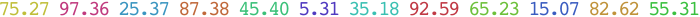

Basics
======

This tool mostly works like `df` as in `df <NOTHING>` gives a brief table while
`df <PATH>` will scope to the filesystem hosting that <PATH>.  It's basically
just a dumb `statfs(1)` formatting program you might enjoy.  A bit more detail:
```
  dfr [optional-params] [paths: string...]

Print disk free stats for paths in user-specified units (GiB by default).

  -d=, --devs=  strings cgroup_root  devices to EXCLUDE
  -f=, --fs=    strings devtmpfs     FS types to EXCLUDE
  -u=, --unit=  float   1073741824.0 unit of measure
  -s, --pseudo  bool    false        list pseudo FSes
  -a=, --avail= float   0.0          exit N if this % is unavailable on N args
  -D, --Dups    bool    false        skip dup-suppressing stat
  --colors=     strings {}           color aliases; Syntax: name = ATTR1 ATTR2..
  -c=, --color= strings {}           text attrs for syntax elts; Like lc/etc.
  -p, --plain   bool    false        do not colorize
```

More Motivation
===============

The default report is a bit nicer than usual `df` fare.  It looks like:
```
Filesystem        Total     Used    Avail  Use% IUse% MntOn
/dev/root        930.32   445.35   484.97 47.87  0.58 /
tmpfs            125.00     0.00   125.00  0.00  0.00 /dev/shm
/dev/nvme1n1p1   372.43   116.90   255.53 31.39  0.00 /3
```
GNU `df` has a --block-size parameter, but its 1 KiB default is antiquated.
There is no `DF_BLOCK_SIZE` or config file.  So, you are stuck with shell
aliases and it also rounds down to the nearest block integer.  While I'm sure
Big Tech guys have petabyte+ scales, basically GiB to units of 0.01 GiB or
0.01 TiB are mostly what you want these days on "home file systems".  Defaults
here get you to 99999.99 GiB = 100 TiB in 8 terminal columns.

Even with `dfr -u$((1<<40))` for TiB units, the extra 2 decimals reach down to
10GiB precision while "centering the numbers" on the TiB scale - also nicer.
Reasonable people can differ, but, at least for this kind of report, my view is
that one *fixed* unit scale is more "human readable" than what GNU `df` calls
`--human-readable`.  Often one does `dfr` just to see "Where is there space?"
and so there is an implicit "human mind comparison" in play which is aided by
a consistent scale rather than varying K/M/G/T units.  This even relates to
utility of the "percentage" columns.

You can also see that besides direct data space usage/availability, terminal
space reclaimed by more centered units can be re-purposed to add i-node usage
in a single table (though, yes, some FSes can dynamically grow space for
such)..No need for `df -i`.

Configuration
=============

I also wanted to embellish rows by how critically full file systems are.  My
personal `~/.config/dfr/darkBG` looks like:
```
# True Color Terminal 12 color spectrum w/colorless at the top end (post pink)
color = "header inverse"
color = "pct0   fsw0.000"               # Dark Violet
color = "pct10  fsw0.091"               # Dark Indigo
color = "pct20  fsw0.182"               # Light Blue
color = "pct30  fsw0.273"               # Cyan
color = "pct40  fsw0.364"               # Seafoam Grue
color = "pct50  fsw0.455"               # Green; cf. FargoS1/Malvo Query
color = "pct60  fsw0.545"               # Grellow
color = "pct70  fsw0.680"               # Yellow
color = "pct80  fsw0.750 bold"          # Light Orange; Start to worry
color = "pct85  fsw0.818 bold"          # Dark Orange; Concerning
color = "pct90  fsw0.909 bold italic"   # Red; Worry more
color = "pct95  fsw1.000 bold inverse"  # Pink; Worry a lot
color = "pct100 FHUE+ bold inverse"     # >100%: NO COLOR; White hot
```
A `dd` filling up `/dev/shm` makes (with a little manual editing) the above
color scheme and `(while {sleep 0.25} {df /dev/shm})>colors` produce .

The percentage levels can be any integers you like.  You can, of course, have
different `~/.config/dfr/lightBG`, `~/.config/dfr/linuxVT` with other color
schemes or else just do something like the above in a `~/.config/dfr` file
(instead of a `dfr/` directory).

A `~/.config/dfr/lightBG` analogue is:
```
color = "header inverse"
color = "pct0   fsw0.000,0.7,0.75"              # Dark Violet
color = "pct10  fsw0.091,0.7,0.75"              # Dark Indigo
color = "pct20  fsw0.182,0.7,0.75"              # Light Blue
color = "pct30  fsw0.273,0.7,0.75"              # Cyan
color = "pct40  fsw0.364,0.7,0.75"              # Seafoam Grue
color = "pct50  fsw0.455,0.7,0.75"              # Green; cf. FargoS1/Malvo Query
color = "pct60  fsw0.545,0.7,0.75"              # Grellow
color = "pct70  fsw0.680,0.7,0.75"              # Yellow
color = "pct80  fsw0.750,0.7,0.75 bold"         # Light Orange; Start to worry
color = "pct85  fsw0.818,0.7,0.75 bold"         # Dark Orange; Concerning
color = "pct90  fsw0.909,0.7,0.75 bold italic"  # Red; Worry more
color = "pct95  fsw1.000,0.7,0.75 bold inverse" # Pink; Worry a lot
color = "pct100 FHUE+ bold inverse"     # >100%: NO COLOR; White hot
```

Color & Origin Function Continuity
==================================
This kind of application sits in a notable place thinking about smooth color
scales.  The above configs use only 12, not 100 elements of the cligen
f)oreground s)cale w)avelength colors.  This relates to `df` reports appearing
in `${MTAB:-/proc/mounts}`-order, not fraction-full-order.[^1]  The latter would
more be the analogue of the continuous "surfaces" that color scales like Viridis
are designed against.

`dfr` wants "order discontinuous in used-ness" for a few reasons.  Even if it
weren't for its ASAP mode of operation and it did wait for all file systems to
report to sort in various orders, it is highly likely a user would want orders
that differed by the order being colored.  E.g., by device order or by total
size or file system type or multi-level with local first then remote or etc.

This is not an isolated situation.  Similar arises in spacetime categories of
[`lc`](https://github.com/c-blake/lc) or
[`procs`](https://github.com/c-blake/procs) where file name / type order or
kernel scheduling order all randomize "other amount-order" for amounts which are
otherwise near-continuous and nice to have a little color and nice to map to a
numerical-like range.  Though the variable space is very fine-grained and though
side-by-side gradations can be very fine and distinguished, I think humans are
good at "back mapping" only 7..14 "ordered colors", and the latter matters in
"discontinuous" / "out of order" / "scrambled" presentations.  You need to back
map to something to "read" and names are easier than numbers for most.

A simple heuristic for this skill is looking at a scrambled list and being able
to assign names accurately, even if they are self-invented / made up names like
"grellow" or "low/middle/high" green instead of Mr. [Roy G.
Biv](https://en.wikipedia.org/wiki/ROYGBIV).  This kind of ability must vary a
lot across populations, but I can personally do this one quite well:[^2]


The color scheme is simply what the lightBG config above describes but with bold
/ italic / inverse redundant cues disabled.  Note that more pixels obviously
helps the signal/noise ratio.  So, background colors are easier.  In the case of
`dfr`, this is why the entire row of foreground text is the same color instead
of output being even more kaleidoscopic with per-column colors.  If you are into
this sort of thing, you might run the
[colorScl](https://github.com/c-blake/cligen/blob/master/cligen/colorScl.nim)
test program (which could profitably grow a randomizing mode).

Other Ideas
===========
There are other whole theories of "layered" scales one can use here.  One can
lean more heavily on fonts.  For example, lighter weight fonts for <25%, regular
for 25-50, bold for 50-75 and bold-italic for 75-100.  That alone may be enough
for many people.  If you want more granularity, *within* each font bank you can
use 6 instantly nameable colors giving you a range of 24 bins.  Or color could
be the primary level and font moves a secondary gradation.  Either way you must
then read *two* things to guide your eye toward important numbers and what works
best is subjective.  A terminal with `blink` can use that for 100% { unless that
is a routine situation which may annoy you :-) }.  There is really a lot of
[CHOICE](https://github.com/c-blake/cligen/wiki/Text-Attributes-supported-in-Config-files).

[^1]: Hanging network file systems remain "a thing" even in 2023 (though I
personally often avoid them). 

[^2]: No, I have not stopwatch-timed myself.  Moreover, I have no idea if I am
better or worse at this than most, but am too lazy at the moment to try to track
down studies which not only handle categorical names, but color names *embedded
in linear orderings* which matters modeling "scales".  The 12 I use here feels
near the limit of my comfort zone.  Finer gradation would make this aspect a
distracting enough puzzle to defeat niceness of color as a redundant cue.  You
are free to try 100 level scales in `dfr` configs if you like, though.
