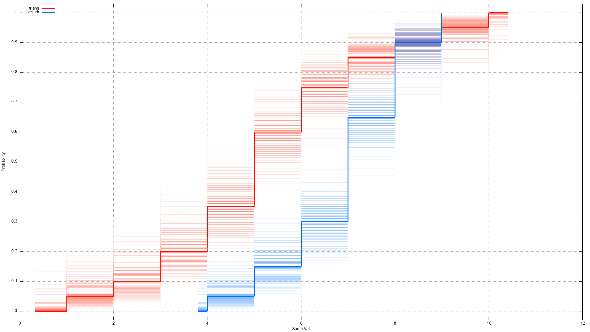
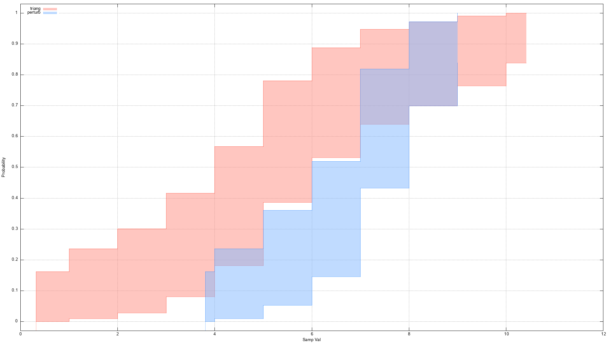
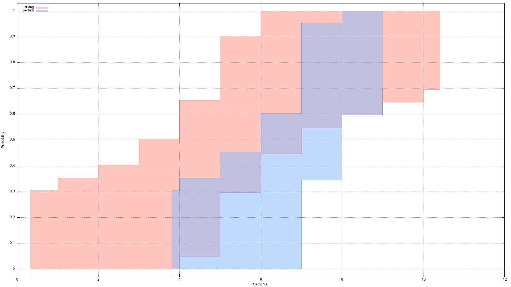
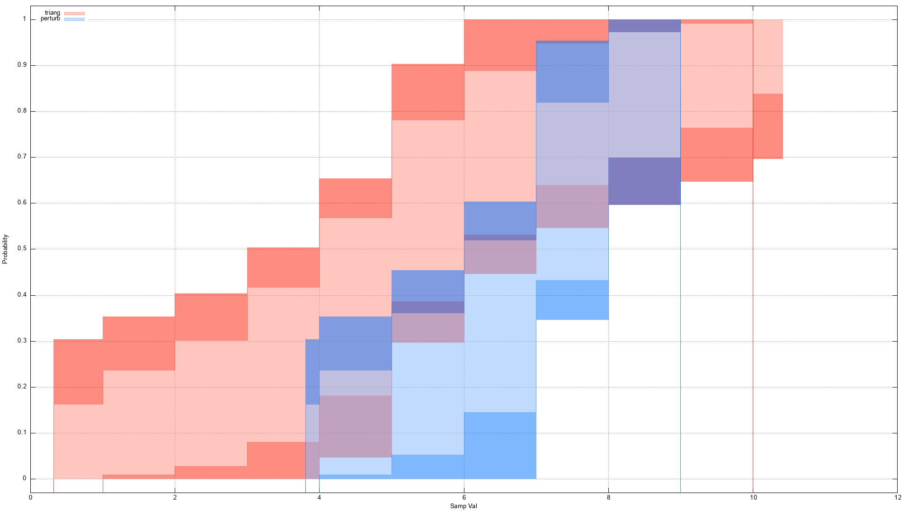
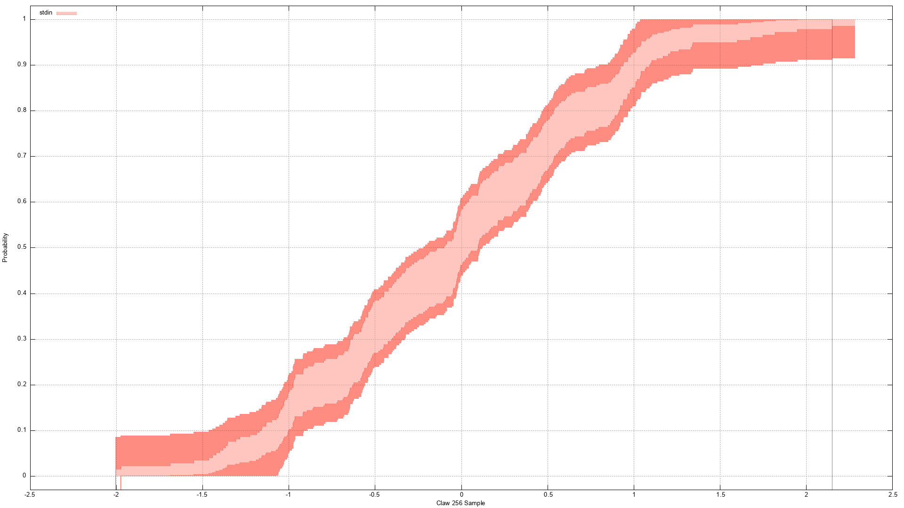

Motivation
==========
[`tim`](tim.md) gives an example way to collect durations and uses
[`eve`](eve.md) to estimate the minimum values, but, as mentioned in the [tim
doc](tim.md), one is sometimes interested in the whole distribution, perhaps
summarized more graphically than analytic-numerically { say via
[approximate](https://c-blake.github.io/adix/adix/mvstat.html) or [exact
interpolated quantiles](https://github.com/c-blake/fitl/blob/main/fitl/qtl.nim)
used either directly or [by
re-sampling](https://github.com/c-blake/fitl/blob/main/fitl/cds.nim) }.  This is
a common way of comparing two or more data samples, often but by no means
exclusively of run-times, for similarities, differences, and features.  This is
what `edplot` is for (short for "Empirical Distribution Plot").

Background (A)
==============
The first question is why to use/show [an EDF](
https://en.wikipedia.org/wiki/Empirical_distribution_function) instead of a
[histogram](https://en.wikipedia.org/wiki/Histogram) or some other [density
estimate](https://en.wikipedia.org/wiki/Density_estimation).  The answer is
simple: no free parameters (beyond "confidence interval size"-like ones).[^1]
Free parameters slow science (construed most broadly), inviting methodological
debate.  [KDEs](https://en.wikipedia.org/wiki/Kernel_density_estimation) improve
on histograms by averaging over bin alignment[^2], but data can be many-scale
(need variable bin width/bandwidth) leading to the number of parameters also
needing estimation.  EDFs sidestep all such concerns & are a good estimate of
true population distributions with multiple known error bands for finite-samples
that are distribution free & non-parametric.

I also prefer density / derivative / PDF "Speak", ***BUT*** the disagreement on
bandwidth selection techniques is staggering.  There are (easily!) ten thousand
papers on many dozens to hundreds of proposals in academic statistics on
bandwidth selection since the late, great Emanuel Parzen got people interested
in KDEs in 1962 (or maybe Rosenblatt in 1956).  I even have my own ideas along
these lines, but even so, without broad acceptance for multiple-decades, one
gets stuck debating methods not analyzing data.  So, as a practical/social
matter, ***IF you can*** answer & inspire your questions with EDFs, you probably
should.  The most common reason people do not is not having spent time to learn
to read/use them; They're popular in social sciences.

Key EDF Properties (B)
======================
Order statistics (the sorted data) form a set of [complete, sufficient
statistics](https://en.wikipedia.org/wiki/Sufficient_statistic).  The theory of
such statistics implies that the EDF is both an ***UNBIASED*** and ***MINIMUM
VARIANCE*** estimator of the true distribution function F(x).  This is another
reason why using EDFs removes doubt - there is no real competitor.  Re-sampling
from EDFs is also the basis of various methods going by the informal name of
["The bootstrap"](https://en.wikipedia.org/wiki/Bootstrapping_(statistics))
which is another way to get results with weaker assumptions (what you want!).

Confidence Bands (C)
====================
The next background point is that an EDF is based upon *just one sample* of what
is usually viewed in statistics as a potentially *unbounded sampling process*
whose traits we seek to understand.  As such, it is not usually the end of the
story.  There is uncertainty about what it implies about the population
distribution.  There are various ways to analyze and exhibit such uncertainty.
One easy one in this context is a non-parametric [confidence band](
https://en.wikipedia.org/wiki/CDF-based_nonparametric_confidence_interval).
These come in both point-wise (the binomial proportion < x)[^3] and simultaneous
varieties.

As explained in the Wikipedia page, the point-wise band is a lower bound while
the simultaneous band is an upper bound of the uncertainty.  Other than this,
neither rely upon the shape of the distribution nor asymptotic sample sizes.
So, together they constitute, for a given CI level, a tube with a thick wall
robustly & CI-approximately circumscribing the distribution function of the true
population.

Boundaries (D)
==============
One thing ordinarily just "clipped conveniently" in a classical EDF estimate is
chances of being below the sample min or above the sample max.  For true
distributions which are discrete, it may be literally impossible to see such
values.  So, pinning to the sample min/max or even a plot of "impulses" is best.
However, for true distributions of a *continuous* random variable, no finite
sample can *ever* see a true population minimum.  Estimating such is the project
of [`eve`](eve.md), and we simply use those estimates here.[^4]  They are used
to decide how "wide" lines along P=0 & P=1 are.  Many distributions like time
durations are continuous to good approximations.

Usage
=====
```
  edplot [optional-params] input paths or "" for stdin

Generate files & gnuplot script to render CDF as confidence band blur|tube.
If .len < inputs.len the final value of wvls, vals, or alphas is re-used for
subsequent inputs, otherwise they match pair-wise.

  -b=, --band=   ConfBand   pointWise  bands: pointWise simultaneous tube
  -c=, --ci=     float      0.02       band CI level(0.95)|dP spacing(0.02)
  -k=, --k=      int        4          amount of tails to use for EVE; 0 => no
                                       data range estimation
  -t=, --tailA=  float      0.05       tail finiteness alpha (smaller: less
                                       prone to decided +-inf)
  -f=, --fp=     string     "/tmp/ed/" tmp File Path prefix for emitted data
  -g=, --gplot=  string     ""         gnuplot script or "" for stdout
  -x=, --xlabel= string     "Samp Val" x-axis label; y is always probability
  -w=, --wvls=   floats     {}         cligen/colorScl HSV-based wvlens; 0.6
  -v=, --vals=   floats     {}         values (V) of HSV fame; 0.8
  -a=, --alphas= floats     {}         alpha channel transparencies; 0.5
  -o=, --opt=    TubeOpt    both       tube opts: pointWise simultaneous both
  -p=, --propAl= BinomPAlgo Wilson     binomial p CI estimate: Wilson, etc.
  -e=, --early=  string     ""         early text for gen script;Eg 'set term'
  -l=, --late=   string     ""         late text for script;Eg 'pause -1'
```

Examples
========
To be easy to reproduce & also ease visually plot debugs, a running example here
will be two 20 point data sets: `triang` - a distribution with a roughly
triangular PDF from: `(seq 1 10;seq 3 7;seq 4 6;seq 5 5;seq 5 5)>triang` and
`perturb` - an invented perturbation from `triang` that can be made from
`(seq 4 9;seq 5 9;seq 6 8;seq 7 8;seq 7 8;seq 7 7;seq 7 7)>perturb`.[^5]
The difference is ***just*** big enough to fail a [2-sample KS
test](https://en.wikipedia.org/wiki/Kolmogorov%E2%80%93Smirnov_test#Two-sample_Kolmogorov%E2%80%93Smirnov_test)
for same parent population at the 5% level.[^6]  The perturbation is just a bit
narrower and a bit up-shifted.  These data are just to have concrete things to
plot, not a full course on interpreting distributions and their differences as
that seems out of scope.

So, here are 4 basic examples.  Something to keep in mind as you read the plots
is "which one best communicates 'only marginally different' to me?".  "Inspiring
next questions" in §A above relates to "Do I *need* a precise statistical test
(e.g. KS-2-sample) to decide a question OR does a picture make it self-evident?"

First, a "smear" plot where many CIs are drawn at fixed steps apart (2% here)
from the `--ci` option from `edplot -w.87 -w.13 -bp triang perturb`[^7]:
.  (Simultaneous bands in such a plot are all "spaced the
same" vertically and so are less visually engaging.)

Next, `edplot -w.87 -w.13 -bt -op triang perturb` renders only partly solid
shaded regions of the pointwise bands from Wilson scores: .

Third, `edplot -w.87 -w.13 -bt -os triang perturb` shows a similar visualization
with the wider Massart inequality simultaneous bands: .

Finally, `edplot -w.87 -w.13 -bt -ob triang perturb`:  shows
the lower & upper bounds of each bands as a darker, more solid region with the
"definitely at least this uncertain at this CI" bands in the middle.

Personally, I find the 2nd or 3rd variants the easiest to read, but I do like
how the final variant most boldly emphasizes what one most surely knows about
the true distribution functions, and I also have some affection for the first
as a more classic shade most darkly closest to the center of an estimate.  Hence
all remain represented with different CL options.

If you have a series of colors you like, just put `wvls=0.87`, `wvls=0.13`,
`band=tube`, etc. in your `~/.config/edplot` config file, and similarly for
other CLI options to reduce your keystrokes to just `edplot a b|gnuplot`.

Once you have things set up, you can plot distributions from various sources.
For example, an AB-comparison of interpreter startup times using [tim](tim.md)
might be interesting:
```
tim -k4 -n20 -m20 -sj "bash<$n" "awk ''<$n"
236 +- 20 μs    (AlreadySubtracted)Overhead
833 +- 28 μs    bash</n
720 +- 25 μs    awk ''</n
edplot <(awk '/h/{print $1*1e6-236}'<j) <(awk '/k/{print $1*1e6-236}'<j)|gnuplot
```
In my attempt, I got widely separated bulk bodies but some overlap in the upper
tails, but these kinds of things are often hard to reproduce.

A Sample From The "Famous" Claw
===============================
In the density estimation literature, a distribution often used as a test case
is fancifully called "The Claw".[^8]  This is a mixture distribution of 50% a
standard unit normal N(0,1) with 50% one of 5 narrower (0.1 standard deviation)
modes at -1, 0.5, 0, 0.5, +1.  Here is what a sample of size 256 { from simply
[`dists`](https://github.com/c-blake/fitl/blob/main/fitl/dists.nim) `-n256 -dClaw`
} looks like with the final tube with borders visualization: 

The interpretability hazard in all work like this is "over-concluding from just
one sample" (and often a small one at that).  What I like about this
visualization is that the ***fat band guides the eye to not over-conclude***
while still leaving breadcrumbs of emerging evidence.  For example, for the data
above, if one tests for "Gaussian or not" via several [standard statistical
tests](https://github.com/c-blake/fitl/blob/main/fitl/gof.nim), the answer is
roughly, "only borderline inconsistent with Gaussian" (for, as usual, inspecific
departures):
```
gof -g,=,k,c,a -a,=,e,f -e,=,s,p -- the data
mD: 13.68
P(mD>val|Gauss): 0.08660
mW^2: 0.1514
P(mW^2>val|Gauss): 0.02160
mA^2: 1.064
P(mA^2>val|Gauss): 0.009200
```
The first K-S test (related to the outer fat band) alone doesn't even exclude
consistency with Gaussian sampling at 8%, though the other 2 slightly more
powerful tests suggest it is getting unlikely at 2% and 1% alpha levels.
Knowing the answer, it is easy to fool oneself in thinking any visualization
says more than it really does.  The challenge is: How to present evidence that
suggests conclusions of just the right strength to those with minimal training?

The bottom line is that if this data sample is supposed to say something about
other samples from The Same[^9] process, you should really only look at "large
scale shape" and imagine a swarm[^10] of all possible monotonic curves through
such.  (You can also widen | narrow targeted CIs from 95%, of course.[^11])

Conclusion
==========
`edplot` emits files to plot to try to support principled visual reasoning about
data sets based on EDFs and related uncertainties in distribution not density
space.  Its defaults are set up for a prior assumption of a continuous true
distribution.  Once you learn to read them, these plots are very "full
information" containing ways to answer many questions about data sets.

[^1]: Technically, the `k` used to assess the data range, is a non-probability
free parameter, but A) this is also needed (though admittedly usually neglected)
for density estimation and B) Fraga Alves & Neves 2017 has a story for setting
`k` we might be able to use.  So, at the least the current state is one less
free parameter - the same improvement a KDE has over a histogram.

[^2]: Averaging over such [nuisance
parameters](https://en.wikipedia.org/wiki/Nuisance_parameter) is a standard
Bayesian tactic.

[^3]: Estimating the `p` in a binomial random variable is itself [a large
topic](https://en.wikipedia.org/wiki/Binomial_proportion_confidence_interval)
only partially covered by the
[`spfun/binom.nim`](https://github.com/c-blake/spfun/blob/main/spfun/binom.nim)
module.

[^4]: We do so with no visual indication of *their* uncertainty at the moment.
One idea is "(..." on the 0-axis and "......)" on the 1-axis or perhaps an even
fainter line extending beyond the data range.

[^5]: If it's easier to copy-paste number lists than run `seq` these expand to
1 2 3 3 4 4 4 5 5 5 5 5 6 6 6 7 7 8 9 10 and
4 5 5 6 6 6 7 7 7 7 7 7 7 8 8 8 8 8 9 9.

[^6]: `max |F_a(x)-F_b(x)|` is @5,6,7=9/20=0.45; Wiki table gives `1.358 *
sqrt(40/400)` which is 0.43.

[^7]: Day-to-day, I just run `edplot ...|gnuplot` which dumps sixels to my
patched `st` terminal via a `$GNUTERM` setting.  These plots were instead made
by un-commenting `early = "set term png...; set out"` in my `~/.config/edplot`.
For an interactive X Window, `-e 'set term x11' -l 'pause -1'` or the similar
long-option version in `~/.config/edplot` also works.

[^8]: The claw is so named because its *density* looks like a 5-fingered animal
paw.  https://people.maths.bris.ac.uk/~wavethresh/help/claw.htm has an image.
There are others with even finer structure like "the comb" and so on.  Many test
distributions & basic probability theory are implemented in
[dists](https://github.com/c-blake/fitl/blob/main/fitl/dists.nim).

[^9]: This means both old & forecast numbers are [independent & identically
distributed](https://en.wikipedia.org/wiki/Independent_and_identically_distributed_random_variables)
is an essential pre-condition for pooling numbers in the first place.  These
assumptions ideally should be verified, e.g. distributional similarity across
time for identicality & serial autocorrelation of various lags for independence
via permutation testing.  For timings of computer activity, it should be noted
that almost everything modern OSes/CPUs do makes times "dependent by design".
Ensuring future samples are from the same process is also hard.  If, however,
the variable in question is a *min time*, as in [`tim`](tim.md), you may have a
less hostile problem setting (a big motivation for min times/that loop nesting).

[^10]: In fact, https://github.com/c-blake/fitl/blob/main/fitl/cds.nim is one
such way to generate such a swarm via interpolated re-sampling.

[^11]: One can, of course, also put error estimates on top of density estimates,
but this is about as rare as error estimates on distributions and comes with the
same bandwidth(s) & kernel(s) question previously mentioned.
