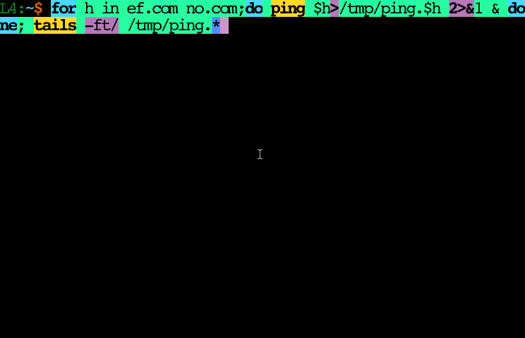

Motivation/Overview
-------------------
This generalizes `head` & `tail` into one program which can also do things which
would require (at least!) fancy FIFO tricks to otherwise accomplish (like both
the beginning & end of the same stream).  `tails` is intended to be mnemonic for
"tails of a probability distribution" (i.e. low & high sides of the 1-D range).
It also adds abstract input & output records, a config file, and user-customized
cycling, possibly colorized headers, and customized source switching notation.

Good application of the config file & cycling headers is to put 3..9 (whatever
you can easily remember/distinguish) instances of `header` in the config file.
Most graphical plotting facilities have this feature for line styles.  I like
varying color, but if you hate color you can use other textual embellishment
such as many stars, slashes, ampersands, ASCII art, etc.  Like plotting line
styles, little stops you from using *both* the analogue of color + solid/
dot/dash/..  On many terminals even blinking text is an option.  This eases
seeing file names from each other & from surrounding text.

It eases so much that you can usually avoid blank line-preceding headers, common
in other head/tail impls[^1] (more so for BG color-dominant "inverse modes" with
their many pixels).  Such distinguishing is always helpful, but is especially so
for output from multiple inputs in unpredictable order as `tails -f A B..` might
produce.  Since when that leading blank is elided, headers (embellished to be
"loud" or not) for non-line-terminated text can appear on the same terminal row
(whereas in a less custom mode there would simply be a dropped blank line).
Since what to do here can vary with taste & situation, `tails` also provides
`--delimit` to decide.  This defaults to off, but it's easy to add a `delimit =
"..."` in a config file & even make it (& optionally the next header!) blink
with some raw \e[5m.

For compatibility, when invoked with an argv[0]/$0 of `head` | `tail`, arguments
are massaged to match GNU coreutils `head` / `tail` (including `-c` & negative
`-n` args, but not *all* features).  About the only thing that does not work is
the highly GNU-specific `--bytes=` long option[^2].  Though not impossible to
support, it goes against the grain of a "combination-head-tail" utility (i.e. it
makes more sense to switch units for both from rows to bytes than to specify the
head part in bytes and tail in rows).

Usage
-----
```
    tails [optional-params] [paths: string...; '' => stdin]

Unify+enhance head/tail to emit/cut head/tail/both.  "/[n]" for head/tail infers
numRows so n-file output fits in ${LC_LINES:-${LINES:-ttyHeight}} terminal rows.
"/" alone infers that n=numInputs.  header, delimit & divide all expand lc attrs
like %[WHITE on_red].

  -?, --help                            print this cligen-erated help
  -h=, --head=           int|/[n] 0     >0 emit | <0 cut this many @start
  -t=, --tail=           int|/[n] 0     >0 emit | <0 cut this many @end;
                                        Leading "+" => head = 1 - THIS.
  -f, --follow           bool     false output added data as files get it
  -c, --bytes            bool     false head & tail are bytes not rows
  -d=, --divide=         string   "--"  separator, for non-contiguous case
  -H=, --header=         strings  {}    header formats (used cyclically);
                                        "" => n==> $1 <==n
  -q, --quiet            bool     false never print file name headers
  -v, --verbose          bool     false always print file name headers
  -i=, --ird=            char     '\n'  input record delimiter
  -e=, --eor=            char     '\n'  output end of row/record char
  -s=, --sleep-interval= float    0.25  this many seconds between -f loops
  -D=, --delimit=        string   ""    if non-"" (eg. "..."), source switch
                                        headers begin with THIS + eor when 
                                        no eor is present at switch-time.
  -C=, --Count=          int      0     emit total input count to this fd
  -p, --plain            bool     false plain text; No color escape sequences
```

Examples
--------
```
seq 1 99|tails -h3 -t3|tr \\n ' '
```
emits
```
1 2 3 -- 97 98 99
```
while
```
seq 1 9|tails -h-3 -t-3|tr \\n ' '
```
produces
```
4 5 6
```

A more complete test/example:
```sh
check() {       # Test `tails` modes
  r="$(seq 1 9|tails -d- $1 | tr \\n ' ')"
  [ "$r" = "$2" ] || {
    printf "seq 1 9|tails -s- $1 = \"$r\" != \"$2\": "
    shift 2; echo "$@"; }; }
check "-h3"       "1 2 3 "             h+
check "-t3"       "7 8 9 "             t+
check "-h-3"      "4 5 6 7 8 9 "       h-
check "-t-3"      "1 2 3 4 5 6 "       t-
check "-h3 -t3"   "1 2 3 - 7 8 9 "     h+  t+  discont
check "-h-3 -t3"  "7 8 9 "             h-  t+
check "-h3 -t-3"  "1 2 3 4 5 6 "       h+  t-
check "-h-3 -t-3" "4 5 6 "             h-  t-
check "-h5 -t4"   "1 2 3 4 5 6 7 8 9 " h++ t++ justOvLap
check "-h9 -t9"   "1 2 3 4 5 6 7 8 9 " h++ t++ majorOvLap
check "-h20 -t20" "1 2 3 4 5 6 7 8 9 " h++ t++ majorOvLap
check "-h-5 -t-4" ""                   h-- t-- dropAll
check "-t+4"      "4 5 6 7 8 9 "       tP
```

A terminal example { with terminal no wrap wrapper script sending escape codes
mentioned over in [tw](tw.md) }:
```
nw tails -ft/ log.1 log.2 log.3
```
should show with colorized file name headers (if so configured) as much of the
ends of the logs as fits on one screen, and then follow each one.  You could
cycle background color of text through red, green, blue, etc.  Here is an
example of pinging two hosts: .
which came from a `~/.config/tails` file abbreviated as:
```
# Nim parsecfg strips first \n; So for leading \n you must put in 2 line breaks.
header = """%[WHITE on_blue]==>    $1    <==%[none]
"""
header = """%[WHITE on_red]==>    $1    <==%[none]
"""
delimit = "%[inverse blink]…%[none]"
divide = "%[bold]_-^-_-^-_-^-_-^-_-^-_-^-_-^-_-^-_%[none]"
```

Related Work
------------
[funnel](funnel.md) is more a "pipeline helper" rather than a "terminal app"
and *only* works on FIFOs.

[multitail](https://www.vanheusden.com/multitail/manual.html) is a full ncurses
style terminal app that does more inside-data-coloring, but does not seem to
have a "both head & tail of one stream" feature.

https://github.com/c-blake/nio/blob/main/nio.nim#L1014 may be helpful for
pre-parsed data.

[^1]: This is even more helpful if you are using the `-t/` mode & many files
since getting that "extra" row of actual data multiplies.  The ancient "==> <=="
header convention is archaeological evidence that `head` / `tail` with multiple
rather than single inputs were *ALWAYS* terminal apps, just stuck in 1970s line
printer esthetics.  The header blank is just a less general solution to what is
here called `delimit`.

[^2]: Presently, `tails` also does not work on FIFO/unseekable inputs other than
stdin pipes or with efficient but non-portable filesystem notification systems,
but see [funnel](funnel.md).  As a TODO `tails` should translate `-z` to similar
`ird` / `eor` settings.  For me, re-opening path names in `tail -f` seems the
wrong approach to log rotation (which should suspend writing, copy & truncate,
not rename as in https://github.com/c-blake/kslog).  `-F`, `--retry`, &
`--max-unchanged-stats` all feel like chasing after a bad idea - adapting `tail`
rather than making log rotators not need new file descriptors (most likely since
`tail` was a simpler program to adapt!).  The "caller does a `>foo`" protocol is
almost as simple as `--pid` & invulnerable to pid-wraparound races.
