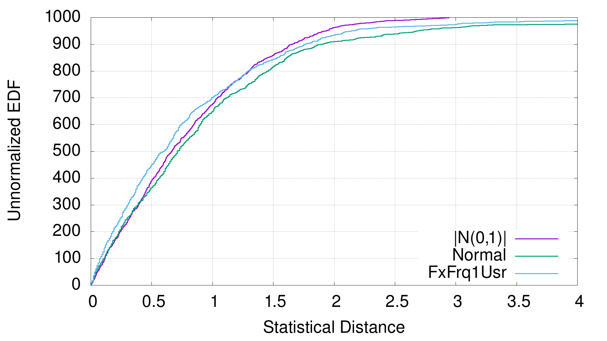

Background
==========
Often one has some program/operation of interest that takes 1..500 milliseconds.
One may want to time it to use as a benchmark.  While computers are conceptually
deterministic, in practical settings on general purpose OSes[^1] asynchronously
interacting with physical devices, all you can really measure is:

(1) `observed_time = t0 + noise`

**`t0` is what you want** because `noise` (more or less by definition) does not
generalize/reproduce to other minutes/days/noise environments.  Even with no
time-sharing, various coupled interactions[^2] degrade determinism of timing -
especially at certain human timescales deemed acceptable by OS designers (under
some load assumptions).  So, a random model for `noise` makes sense (though
noise could have a very structured distribution, depending).

This seems like a "statistics to the rescue" scenario, but caution is warranted.
In most deployments, `noise` from Eq.1 is both time varying
([non-stationary](https://en.wikipedia.org/wiki/Stationary_process)) and
[heavy-tailed](https://en.wikipedia.org/wiki/Heavy-tailed_distribution) due to
varying load and **imperfect control over competing activity**.  Both
statistical properties make both value & error estimates of **flat averages that
include ALL OF `noise` mislead**.  The mean is likely dragged way up.  Errors in
the means explode.  Neither converge as you might think from [Limit
Theorems](https://en.wikipedia.org/wiki/Central_limit_theorem).  Non-stationary,
non-independent noise violates base assumptions of most applied statistics.

Solutions
=========
The scale of `noise` compared to `t0` can vary considerably.  A popular approach
is to avoid sub-second times entirely, making benchmarks **many seconds long**
to suppress `noise`.  Sometimes people "scale up" naively[^3] to get hard to
interpret and/or misleading results.  Since it is also not always clear how much
scaling up is "enough" anyway or what the residual noise scale is, this can
really magnify waiting time for results via many samples of a long benchmark.

Maybe we can do better.  While statistical strategies (like [eve](eve.md) or
MLEs for "sampling cast" Weibull distributions) exist, a low sophistication way
to estimate reproducibly Eq.1's `t0`, in spite of noise hostility, is a simple
sample minimum which is what `tim` is about.  This **filters out all but the
minimum noise** - better behaved than average noise.

However, this gives no estimate of estimator error.  That error estimate matters
since one needs an **infinite** number of trials to get the true minimum.  We
instead want to economize on our repetitions.  Once so economized, you need to
know what the penalty was in "compared-to-what scenarios" like benchmarking.

A low art way to estimate the error on the sample min `t0` estimate is to find
the mean,sdev for the best **several** times out of many runs.  Instead of
filtering out 90% of the noise (for say 10 runs), you can filter out only 70% &
average the 3 least order stats to get a weak estimate of the 15th percentile.

This clearly only **upper bounds** `t0`, but it's as close as a 15th percentile
is representative which is to say - probably close.  Clustering variation of
min-side order stats also only **vaguely correlates with error** on the
estimator of `t0`.  Other ideas (like the difference between the 2 smallest
times) are surely possible, but sdev(best) seems workable in practice.  Just
"err" in scare quotes will refer to this to indicate best choice vagueness.
[Empirical Evaluation](#empirical-evaluation-of-t0-error-estimates) has details.

On top of this layers a natural extension to gauge **if your benchmark gives
stable times in the min-tail in the first place**.  The extension is to simply
do 2 back-to-back trials of the base procedure & verify the quantile-means are
within some number of standard deviations of each other.  **If so**, then you
have some evidence for thinking the distribution of the 2 samples is the same
(at least near the min).  **If not**, you should take action to correct this
before concluding much (even on an isolated test machine) such as `taskset`,
`chrt`, fixing CPU frequency dynamically in-OS, or even rebooting into a BIOS
with a fixed freq CPU (or your OS's equivalent of these Linux interventions).

`tim` wraps all these ideas up into a simple command-line invocation where you
just pass some valid command (probably not outputting anything to terminals).
It even prints out a nice error message when times are too unstable.

Usage
=====
```
  tim [optional-params] [cmds: string...]

Run shell commands (maybe w/escape/quoting) 2R times.  Finds mean,"err" of
the best runs twice and, if stable at sigma-level, merge results (reporting
mean,"err" of the best of all runs).

  -b=, --best=  int    3   number of best times to average
  -r=, --runs=  int    10  number of outer trials
  -s=, --sigma= float  7.0 max distance to declare stability
  -w=, --write= string ""  also write times to this file
```

An Example, Measuring Shell Overhead
====================================
POSIX shells have a standard built-in command `:` which only expands its
arguments.  So, at least on Linux, one can do this:
```sh
$ tim : :
(3.53 +- 0.15)e-04      :
(3.70 +- 0.10)e-04      :
```
to time two commands.  In this case, they are the same, both `:`.  (It could
have instead been `tim 'this way' 'that way'`.)  The values are 0.94 "err"s
apart.  (My /bin/sh -> dash, not bash & statically linked dash is easily 3..4X
faster than bash for this.  Automatically measuring & subtracting shell overhead
or optionally minimizing it with `bu/execstr.nim` are possible future work.)

Empirical Evaluation of "error" estimates
=========================================
The above example can be generalized to **measure** how coherent the estimate &
errors are with your interpretations.  You can re-purpose `--sigma` to get `tim`
to emit a little report which includes the sigma distance.  That can just be
extracted with simple text manipulation tools.  To get 1000 samples of the
distribution of sigma under noise variation, for example, you can just:
```sh
c=$(printf '%1000s\n' | sed 's/ /: /g')
eval tim -s0 $c|grep apart|awk '{print $2}'|sort -g>/t/a
# plot '/t/a' u 1:0 w step  # gnuplot datum idx vs. val
```
produces for me (under `taskset 0xF chrt 99` on an otherwise "idle" AlderLake
CPU with the GoldenCove cores running Linux 6.1.1)[^4]:

"As a unit", the error is not so far from Gaussian expectations below 2 sigma,
but even with best 3/10, we see **substantial (>5%) sampling in the heavy** 4+
sigma tail.  As evident from this plot, selecting a default `--sigma` to decide
"reproducible" can be..challenging.

A plot of your own test environments can perhaps show how bad this may be for
you, but it is, again, non-stationary in reality.  To whatever level of
stationarity occurs, both shape & scale of this distribution likely also vary
with time scale of the measured program.  So, trying to measure/memorize it is
hard.  **Playing with `--best` & `--run` to reign in the tail** at various
scales seems more likely to be productive of better measurements.  `tim` does
support `~/.config/tim` for setting defaults if you find some you like.

In light of all this, this best n of m idea twice is only a "something is better
than nothing" thing.  It at least has a snowball's chance of being reproducible
somewhat reliably (which is more than can be said of most reports I have seen of
sub-second timings).

[^1]: Find a link to circa 2019 blog about writing own "Measurement OS" to study
how [Spectre](https://en.wikipedia.org/wiki/Spectre_(security_vulnerability))-
like security vulnerabilities play out.

[^2]: Spinning platter disks & handling even ambient broadcast network packets
or other competing action can evict your cache entries on unrelated work.  This
is true even on "mostly idle" machines, though much worse on heavily loaded
machines/networks/etc.  Basically, there is not really such a thing as an "truly
idle" general purpose system..merely "approximately idle".

[^3]: [Ben Hoyt's King James Bible ***concatenated ten
times***](https://benhoyt.com/writings/count-words/), for example, means that
branch prediction and so possibly memory prefetching begins to work perfectly
after just 10% of his benchmark.  Beyond this, hash table sizes become
non-reflective of natural language vocabulary scaling.  How much this degrades
prog.lang comparisons is hard to say.  It's better to avoid it than guess at it.

[^4]: |unitGauss| came from just taking absolute values of 1000 unit normals.
