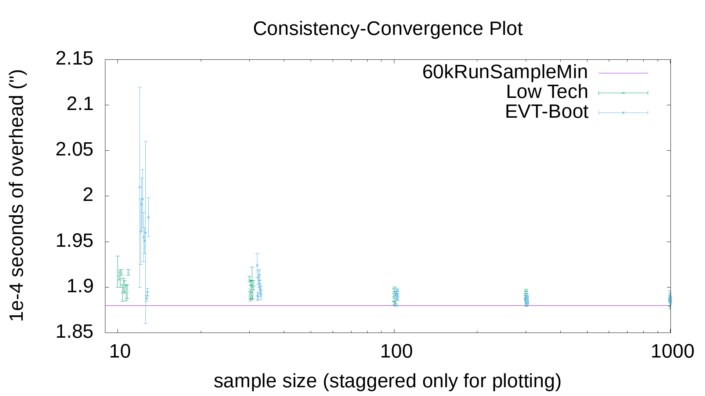

Background
==========
Often one has some program/operation of interest that takes 1..500 milliseconds.
One may want to time it to use as a benchmark.  While computers are conceptually
deterministic, in practical settings on general purpose OSes[^1] asynchronously
interacting with physical devices, all you can really measure is:

(1) `observed_time = t0 + noise`

**`t0` is what you want** because `noise` (more or less by definition) does not
generalize/reproduce to other minutes/days/noise environments.  Even with no
time-sharing, various coupled interactions[^2] degrade determinism of timing -
especially at certain human timescales deemed acceptable by OS designers (under
some load assumptions).  So, a random model for `noise` makes sense (though
noise could have a very structured distribution, depending).

This seems like a "statistics to the rescue" scenario, but caution is warranted.
In most deployments, `noise` from Eq.1 is both time varying
([non-stationary](https://en.wikipedia.org/wiki/Stationary_process)) and
[heavy-tailed](https://en.wikipedia.org/wiki/Heavy-tailed_distribution) due to
varying load and **imperfect control over competing activity**.  Both
statistical properties make both value & error estimates of **flat averages that
include ALL OF `noise` mislead**.  The mean is likely dragged way up.  Errors in
the means explode.  Neither converge as you might think from [Limit
Theorems](https://en.wikipedia.org/wiki/Central_limit_theorem).  Non-stationary,
non-independent noise violates base assumptions of most applied statistics.

Solutions
=========
A **0-tech** approach is to declare differences less than 2-10X "uninteresting".
While not invalid, **practical difficulties** remain.  You cannot always control
what other people find "interesting".  It's also not rare that "interesting"
deltas can be composed of improvement with many smaller stages which then still
need a solution.  Truly cold-cache times often have far bigger deltas than some
proposed range, leading to multiple runs to compare hot-cache results anyway.

The scale of `noise` compared to `t0` can vary considerably.  A popular approach
is to avoid sub-second times entirely, making benchmarks **many seconds long**
to suppress `noise`.  Sometimes people "scale up" naively[^3] to get hard to
interpret and/or misleading results.  Since it is also not always clear how much
scaling up is "enough" anyway or what the residual noise scale is, this can
**compound** waiting time for results via several samples of a long benchmark.

Maybe we can do better.  While statistical strategies (like [eve](eve.md) or
MLEs for "sampling cast" Weibull distributions) exist, a low sophistication way
to estimate reproducibly Eq.1's `t0`, in spite of noise hostility, is a simple
sample minimum which is what `tim` is about.  This **filters out all but
noise(minimum)** - better behaved than average noise.[^4]

However, this gives no estimate of estimator error.  That error estimate matters
since one needs an **infinite** number of trials to get the true minimum.  We
instead want to economize on our repetitions.  Once so economized, you need to
know what the penalty was in "compared-to-what scenarios" like benchmarking.

A low art way to estimate the error on the sample min `t0` estimate is to find
the mean,sdev for the **BEST SEVERAL TIMES OUT OF MANY RUNS**.[^4]  Instead of
filtering out 90% of the noise (for say 10 runs), you can filter out only 70% &
average the 3 least order stats to get a weak estimate of the 15th percentile.

This clearly only **upper bounds** `t0`, but it's as close as a 15th percentile
is representative which is to say - probably close.  Clustering variation of
min-side order stats also only **vaguely correlates with error** on the
estimator of `t0`.  Other ideas (like the difference between the 2 smallest
times) are surely possible, but sdev(best) seems workable in practice.  Just
"err" in scare quotes will refer to this to indicate best choice vagueness.
[Empirical Evaluation](#empirical-evaluation-of-error-estimates) has details.

On top of this layers a natural extension to gauge **if your benchmark gives
stable times in the min-tail in the first place**.  The extension is to simply
do 2 back-to-back trials of the base procedure & verify the quantile-means are
within some number of standard deviations of each other.  **If so**, then you
have some evidence for thinking the distribution of the 2 samples is the same
(at least near the min).  **If not**, you should take action to correct this
before concluding much (even on an isolated test machine).

There are many such actions..1) Shutting down browsers 2) Going single-user 3)
`taskset`/`chrt`, 4) fixing CPU frequency dynamically in-OS 5) Rebooting into a
BIOS with fixed freq CPU(s) (or your OS's equiv. of these Linux interventions),
6) `isolcpus` to avoid timer interrupts entirely, 7) Cache Allocation Technology
extensions to reserve L3, and on & on. (`tim` hopes that simpler ideas can
prevent all that effort most of the time without corrupting benchmark design.)

`tim` wraps these ideas up into a simple library & command-line wrapper.  You
just pass some expression/command to be timed (probably not outputting anything
to terminals).  It prints out an informative error when times are too unstable.

Usage
=====
```
  tim [optional-params] [cmds: string...]

Run shell cmds (maybe w/escape|quoting) 2n times.  Finds mean,"err" of the
best twice and, if stable at level dist, merge results for a final time & error
estimate.

  -n=, --n=     int    10  number of outer trials; 1/2 total
  -b=, --best=  int    3   number of best times to average
  -d=, --dist=  float  7.5 max distance to decide stable samples
  -w=, --write= string ""  also write times to this file
```

Example: Measuring Dispatch Overhead
====================================
Internally, `tim` uses system(3) which passes each `cmd` as a string to a shell.
POSIX shells have a built-in command `:` which only expands its arguments.  So,
at least on Unix-like, one can do this:
```sh
$ tim : :          # OR, e.g., tim 'this way' 'that way'
(3.53 +- 0.15)e-04      :   #NOTE: seconds - so 0.353 ms
(3.70 +- 0.10)e-04      :
```
to time "null" commands twice.[^5]  In this case, we expect times in seconds to
be "the same" and they are.[^6]

Empirical Evaluation of "error" estimates
=========================================
The above example can be generalized to **measure** how coherent the estimate &
errors are with your interpretations.  You can re-purpose `--dist` to get `tim`
to emit a little report which includes distances.  That can just be extracted
with simple text manipulation.  To get 1000 samples of the distribution of dist
under noise variation, for example, you can just:
```sh
c=$(printf '%1000s\n' | sed 's/ /: /g')
eval tim -d0 $c|grep apart|awk '{print $2}'|sort -g>/tmp/a
# plot '/tmp/a' u 1:0 w step  # gnuplot datum idx vs. val
```
produces for me (normal = under `taskset 0xE chrt 99` on an otherwise "idle"
i7-6700k CPU running Linux 6.1.1 with X11, a no-tabs browser, a few terminals,
the network stack and so on running, but zero load)[^7]:

For reference, abs(N(0,1)) and a rebooted BIOS-fixed frequency single-user also
taskset/chrt'd plot are also included.  As a "unit", `dist` is close (in
complementary probability) to Gaussian at <1.5, but the divergence gets bad past
2 Gauss sigmas (with 2X or 3X errors depending on special boot mode or not).  By
3 sigma rare events happen **over 50X** more often than Gaussian.[^8]  Even with
best 3/10, **tails are very heavy**.  Even selecting `--dist` to decide
"reproducible" can be.. challenging.  This **challenge spills over** into any
better-worse comparisons since deltas big enough to be significant may need to
be many "sigma" apart.[^9]

A plot of your own test environments can perhaps show how bad this may be for
you, but it is, again, non-stationary/competing work dependent.  Whatever level
of stationarity occurs, shape & scale of the distribution likely also vary with
time scale of the measured program.  So, trying to measure/memorize it is hard.
**Playing with `--best` & `--run` to rein in the tail** at various scales seems
more likely to be productive of better measurements.[^10]  `tim` does support
`~/.config/tim` for setting defaults if you find some you like.

In light of all this, this best n of m idea twice is only a "something is better
than nothing" thing.

Convergence / Consistency
=========================
The idea of `tim` is fundamentally a sort of "optimization of benchmarking".
Specifically, we want to **repeat as few times as possible** while getting a
vaguely credible measurement error estimate.  A natural next question is "How
many iterations is 'enough'".  Answer to any "enough" question depends (at
least!) upon what users want (e.g. 10%, 1%, 0.1% or some such target error).

However, to validate the methodology itself we can do something as simple as
the overhead calibration measurement (as root):
```sh
for n in 10 30 100 300 1000; env -i PATH=$PATH CLIGEN=/dev/null chrt 99 taskset 0x3 tim -n$n '' '' '' '' '' '' '' '' ''
```
and examine two properties - internal consistency with estimated errors at a
given `n` and convergence as `n` increases.  (The empty string corresponds to
`sh -c ''` which for me is a statically linked `/bin/dash -c ''`.)  We can go
a bit further and try to use [Extreme Value
Theory](https://en.wikipedia.org/wiki/Extreme_value_theory) (this is the max-
operation version of the Central Limit Theorem for summations) as currently
encoded in [eve](eve.md).  What we get is summarized (at least the first 3
points) by: 

The plot artificially staggers the `n` ordinate on the x-axis to make error bars
visible (in a points not overlaying sense, but data is at discrete, round `n`).

A few things are apparent.  First, the estimator seems to be convergent from
above (what stats folk call "consistent") as `n` grows.

Second, the "error of the error" is large.  I.e., at both small & large `n`,
estimated errors are easily 2-3X too small, *but also* sometimes too large by
similar factors.  So, estimating errors here is a real challenge (as is, by
extension, "iterating until an estimate reaches an accuracy target).  Pseudo
T-tests also remain suspect out to very non-Gaussian distances.

[^1]: Find a link to circa 2019 blog about writing own "Measurement OS" to study
how [Spectre](https://en.wikipedia.org/wiki/Spectre_(security_vulnerability))-
like security vulnerabilities play out.

[^2]: Spinning platter disks & handling even ambient broadcast network packets
or other competing action can evict your cache entries on unrelated work.  This
is true even on "mostly idle" machines, though much worse on heavily loaded
machines/networks/etc.  Basically, there is not really such a thing as an "truly
idle" general purpose system..merely "approximately idle".

[^3]: For example, [Ben Hoyt's King James Bible ***concatenated ten
times***](https://benhoyt.com/writings/count-words/) means that branch
prediction and so possibly memory prefetching begins to work perfectly after
just 10% of his benchmark.  Beyond this, hash table sizes become non-reflective
of natural language vocabulary scaling.  How much this degrades his prog.lang
comparisons is hard to say, but it's better to avoid it than guess at it.

[^4]: For *independent* samples, which is of course *NOT* really true here, the
distribution of the sample minimum (noise) itself is the N-th power of the base
hostile distribution.  This makes, e.g., median(min(nTimes)) the
[0.5^n](https://en.wikipedia.org/wiki/Extreme_value_theory#Univariate_theory)
quantile of the times.  For n=20 this is ~1/million.  That sounds small, but is
quite variable on most systems!  The "`tim` estimate" is just an asymmetric or
semi-[truncated mean](https://en.wikipedia.org/wiki/Truncated_mean) with params
under user-control.  (It may be best to report the global over all samples min,
using min-tail only to estimate the error of the estimate.)

[^5]: My /bin/sh -> dash, not bash.  Statically linked dash is 3..4X faster than
bash for this.  Automatically measuring & subtracting shell overhead/optionally
minimizing it with `bu/execstr.nim` are possible future work.

[^6]: The values are (3.7 - 3.53)/(.15^2 + .1^2)^.5 = 0.94 "err"s apart by basic
[error propagation](https://en.wikipedia.org/wiki/Propagation_of_uncertainty)
which uses "smallness" of errors and Taylor series.  The Nim package
[Measuremancer](https://github.com/SciNim/Measuremancer) or the Python package
[uncertainties](https://pypi.org/project/uncertainties/) can make such
calculations more automatic, especially if you are, say, subtracting uncertain
dispatch overhead or want 3.21x faster "ratios".

[^7]: |N(0,1)| came from just taking absolute values of 1000 unit normals.

[^8]: For that graph, at 4 the special mode is also 1.1% vs 2.4% for normal.
So, special boots *can* help (by 2.2X even), but the tail remains quite heavy.
The max distance is 8.0 for the special boot mode and 14.5 for the normal mode.

[^9]: I use "sigma" here loosely as a general scale parameter, not the scale of
a Gaussian/Normal distribution.  Particle physics has "5 sigma" rules of thumb
to declare new science in a similar vein.  5 seems too small for this context.

[^10]: Playing with `err = avg(abs(t - tMin))` definitions also seems a path to
more reproducible error estimates.
