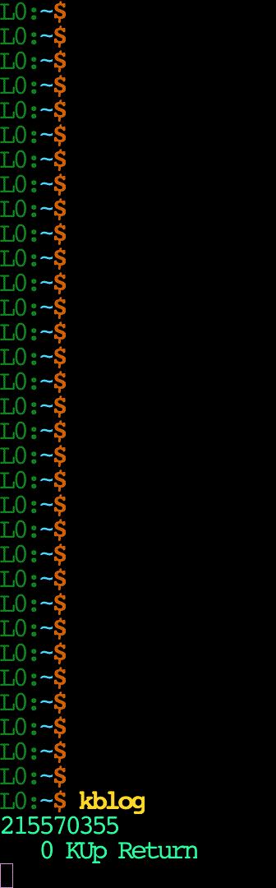
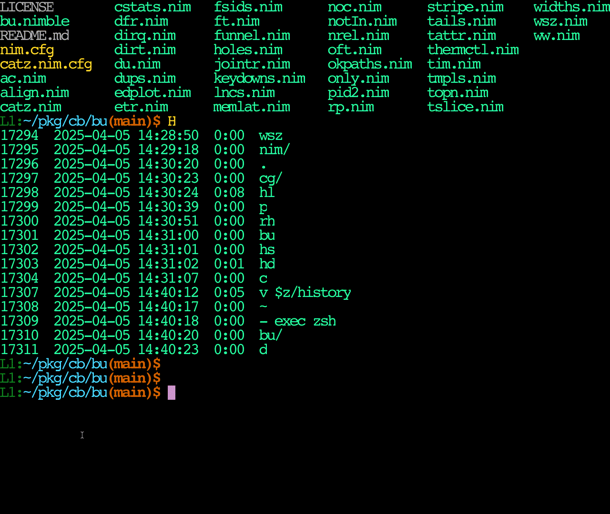

# Motivation / Background

For a long time in Zsh, history-incremental-pattern-search-backward was bound to
my Ctrl-R and that has seemed "ok".  Hearing yet another person rave about `fzf`
made me look again into the UI ideas therein.  It doesn't seem Earth shattering,
but it's not useless to see "a few more" lines than 1 of "preview choices" as
you search.  My muscle memory for using this kind of search is keyed into
literal substrings of characters (what `fzf` calls 'string) and I didn't want to
re-train to type `'`.  Looking at the 24,000 lines of Go to maybe add/find a
mode/CL flag to make `fzf` do that implicitly made me sad, but my interest in
narrow-as-you-go ideas was piqued.

So, I hunted around a bit & found a small, hackable 1000 line C program called
[`pick`](https://github.com/mptre/pick), but it had like 11 problems.  It did
the same kind of key1.\*key2 match as fzf (just too fuzzy for me), took over my
whole terminal like less, didn't do colors, didn't have a case-(in)sensitive
toggle, didn't report match or total counts, show its labels, or have a help
screen.  Utf8 edits didn't work in my `st` terminal and it had a score function
I couldn't reason about in the heat of a search, and did a poll system call
every 50 items which seemed excessive.

Enough seemed wrong/missing/not what I wanted that rather than patch the C, I
re-wrote the whole thing in Nim (only 302 lines + 10 screen, 14 CLI help),
calling out to [`cligen`](https://github.com/c-blake/cligen) for some rich text
stuff and then added/amended all that stuff to make `vip`.  So, now I have a
tool about 1% `fzf` scale with functionality more tuned to my wants (i.e. >100%
of my needs).  I am still thinking about best UI designs here (see Future Work),
but this seems a more useful platform for experiments.

# Usage

Command-Line Interface:
```
  vip [optional-params] initial query strings to interactively edit

vip parses stdin lines, does TUI incremental-interactive pick, emits 1.

  -n=, --n=      int     9      max number of terminal rows to use
  -a, --alt      bool    false  use the alternate screen buffer
  -i, --inSen    bool    false  match query case-insensitively; Ctrl-I
  -s, --sort     bool    false  sort by match score,not input order; Ctrl-O
  -d=, --delim=  char    '\x00' Before THIS =Context Label;After=AnItem
  -l=, --label=  int     0      emit parsed label to this file descriptor
  -D=, --digits= int     5      num.digits for nMatch/nItem on query Line
  -r, --rev      bool    false  reverse default "log file" input order
  --colors=      strings {}     colorAliases;Syntax: NAME = ATTR1 ATTR2..
  -c=, --color=  strings {}     ;-separated on/off attrs for UI elements:
                                  qtext choice match label
```
Like most other [`cligen`](https://github.com/c-blake/cligen) apps, you can
set all those things in a config file|config directory like `~/.config/vip`.

Textual User Interface:
```
Ctrl-O    Toggle Order By Match Size Fraction Mode (/|% in match count )
Ctrl-I    (Aka TAB) Toggle Insensitive Case Mode   ( |- in query prompt)
Ctrl-L    Refresh
ENTER     Pick Selected Item
Alt-ENTER Pick Label For Item
Ctrl-C    Quit Selection
Ctrl-Z    Suspend Selection
List Navigation
    ArrowUp/Down     Up&Down 1-item
    PageUp/PageDn    Up&Down 1 Page
    Home/End         First|Last Page
Query Editing
    ArrowLeft/Right  Move edit cursor
    Backspace/Delete Delete to Left/Right
    Ctrl-U           Delete from cursor to start of q
    Ctrl-K           Delete from cursor to end of q
```

# Examples

A very simple one: `seq 1 9999|vip`

Slightly more complex (and good for testing all the features) is (in Zsh,
though adapting to your own shell should not be hard):
```zsh
(for a in {a..c};{for n in {1..3};{for b in {A..C};echo $a$n$b} })
```

## Command Finding

```zsh
whence -apm \* | vip
```

## Zsh Ctrl-R Integration

If you already use `setopt extendedhistory`, then all you need to do is add this
to your `${ZDOTDIR:-$HOME}/.zshrc`:
```zsh
HC() { local e=$(printf \\e)    # Layered so history query suppression works..
  case "$LC_THEME" in            # ..w/alias Hc='fc -Dlnt%s' & Hc 1|HC| g/l/...
  *li*t*) local cs=(-vR="${e}[31m" -vY="${e}[33m" -vG="${e}[32m"
                    -vC="${e}[36m" -vB="${e}[34m" -vN="${e}[39m") ;;
       *) local cs=(-vR="${e}[91m" -vY="${e}[93m" -vG="${e}[38;2;40;255;160m"
                    -vC="${e}[96m" -vB="${e}[94m" -vN="${e}[39m") ;; esac
  [[ "$TERM" = linux ]]&&cs=(-vR="${e}[31;1m" -vY="${e}[33;1m" -vG="${e}[32;1m"
                             -vC="${e}[36;1m" -vB="${e}[34;1m" -vN="${e}[39m")
  awk $cs 'BEGIN {
    D="'$1'"                            # Label-Item Delimiter Char
    now='$(date +%s)'                   # Time relative to this for ages
    m=60; h=3600; d=24*h; w=7*d         # Time units
    tW=4*w; tD=100*h; tH=100*m; tM=1000 # Thresholds for units
  } {
    A = now - $1                        # Age in seconds
    a = (A>=tW ? A/w : (A>=tD ? A/d : (A>=tH ? A/h : (A>=tM ? A/m :  A ))))
    u = (A>=tW ? "w" : (A>=tD ? "d" : (A>=tH ? "h" : (A>=tM ? "m" : "s"))))
    c = (A>=tW ?  R  : (A>=tD ?  Y  : (A>=tH ?  G  : (A>=tM ?  C  :  B ))))
    match($0, /^[0-9]+  [0-9:]+  /)    # "^epochSeconds  duration  command"
    printf("%s%3d%s%s %6s %s%s\n", c,a,u,N, $2, D,substr($0,RSTART+RLENGTH))}';}
h-vip() {
  local p=$(fc -Dlnt%s 1 | HC , | vip -d, "$BUFFER")
  [[ -n "$p" ]] && { BUFFER="$p"; CURSOR=$#BUFFER; }
  zle redisplay
}
zle -N h-vip; bindkey '^R' h-vip                # Create & bind widget
```

## Video Demo Of Zsh W/Key Stroke Log

|        Key Strokes         |   Terminal Output   |
| -------------------------- | ------------------- |
|    |  |

# Performance

The main optimizations here are the basic flow of `pick`, using `cligen/[mfile,
mslice]`, not sorting at startup with no query, and not bulk-lower-casing until
requested.  Speed was never The Point in my writing `vip` since my personal use
cases are literally 100X smaller than the below 22e6 test and my list gen is
already over 4X slower than `vip`.  I just thought I should check that it wasn't
"too slow for big sets" & was pleasantly surprised.

Timing TUIs is *not* easy. So, I just did something very approximate.  For all 4
of these, I just waited until visual presentation happened & hit ENTER.  I think
I got within 200ms from the CPU %.  Measurements are from an Intel i7-6700k on a
local X11 `st` terminal with march=native (& its equivalents) compilation.  22
million was chosen to be about 1 second or a ballpark limit of my patience:
```sh
t=/dev/shm/j
seq 1 22000000 >$t      # This is 187 MB; All progs memory use kinda sux
vip<$t  # Time: 0.474 (u) + 0.483 (s)=1.160 (82%) mxRSS 1523 MiB
pick<$t # Time: 1.327 (u) + 0.705 (s)=2.234 (90%) mxRSS 1439 MiB
fzf<$t  # Time: 2.110 (u) + 0.873 (s)=2.326 (128%) mxRSS 1503 MiB
sk<$t   # Time: 35.078 (u) + 8.085 (s)=13.325 (323%) mxRSS 7755 MiB
```
The same basic set up but this time pressing "123456" while waiting for the
output each time gives an edge to `fzf` with 8.8 sec vs `vip` 13.7 (seemingly
from `fzf` multi-core use):
```sh
t=/dev/shm/j
seq 1 22000000 >$t      # This is 187 MB; All progs memory use kinda sux
vip<$t  # Time: 9.100 (u) + 1.715 (s)=13.722 (78%) mxRSS 2195 MiB
pick<$t # Time: 16.313 (u) + 1.306 (s)=23.453 (75%) mxRSS 1519 MiB
fzf<$t  # Time: 13.879 (u) + 1.857 (s)=8.824 (178%) mxRSS 3527 MiB
sk<$t   # Time: 1:08.51 (u) + 9.522 (s)=25.092 (310%) mxRSS 9693 MiB
```
So, as usual, YMMV a lot (though `sk` seems generically resource inefficient).

## Combining with `adix/util/lfreq` for frecent dir navigation

You can easily roll your own system like https://github.com/agkozak/zsh-z or
zoxide by adding these or similar to your `$ZDOTDIR/.zshrc`:
```sh
chpwd() { pwd>>$ZDOTDIR/dirs } # Must be LOCAL file & $#PWD < atomicWriteSz
d-vip() {
  local p=$(lfreq -o.9 -f@k -n-999999 < $ZDOTDIR/dirs | vip -r "$BUFFER")
  [[ -n "$p" ]] && { BUFFER="$p"; CURSOR=$#BUFFER; }
  zle redisplay; } # I `setopt autocd` & want to confirm w/a double ENTER
zle -N d-vip; bindkey '^[h' d-vip # Create & bind widget to Alt-h
```
With something like that, Alt-h brings up a picker based on PWD history and you
can start typing to get a selection, hit ENTER, and then ENTER again to confirm
or if you already typed parts of things, that will be the starting query.  There
is nothing stopping you from just saying `cd $(lfreq...|vip...)` if you trust
that you'll always find a match worthy of executing.

This relies upon atomicity of small writes to local files, but for me that limit
is essentially generously bigger than any directory full path in my life.  That
matters since races for shared shells are easily imagined, eg. `for d in $many;
(cd $d; short-running)` in one terminal with interactive `cd` in another.  If
your pwd log is on NFS or something, you will have to do something fancier.

Also, yes - for such application, it may make sense to add some kind of optional
"dynamic validity check" to the filter (in this case dir existence or possibly
execute aka cd-perm on displayed dirs).  That can already be done externally
(eg. `ft -edX|lfreq`), but displayed lists are *MUCH* smaller { enough so that
even launching an external program might cost less than a zillion stat()s }.

# Related Work

I am unsure there is any work prior to the Emacs `anything.el` now named
[`Helm`](https://github.com/emacs-helm/helm) or the C
[`canything`](https://github.com/keiji0/canything) named after it.  I didn't
look very hard.  1970s & 1980s HCI folks seem likely culprits to have originated
the basic idea of narrow-a-dynamic-list-as-you-go, much as they did hypertext.
Tamas Patrovics surely knows more.  Someone should ask him for background.

[percol](https://github.com/mooz/percol) also mentions zaw & peco and a pure Zsh
approach that in said purity allows preserving Zsh syntax highlighting is
[hsmw-highlight](https://github.com/zdharma-continuum/history-search-multi-word).
I'd expect there are dozens more projects.  Happy to list them here if told
about them.

There was some historical Unix `vip` vi-like program, but it's not installed
anywhere these days and 40+ years is long enough to recycle a name.

# Future Work

Maybe a multi-select mode and maybe more pattern dialects than (in)sensitive
substrings or calling out to an arbitrary command like grep for filtering.
