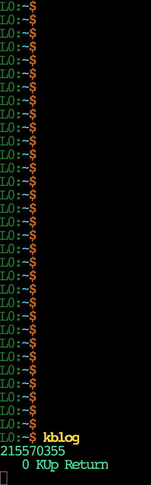
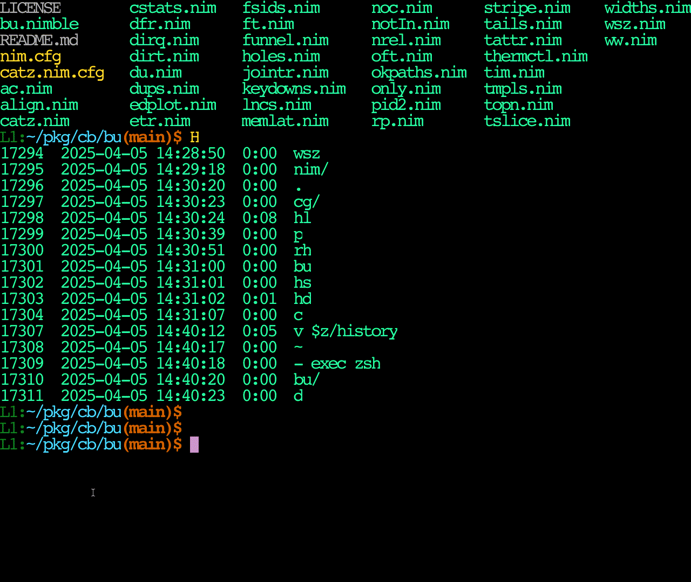

# Summary

`vip` is a small interactive line picker/filter in the spirit of `fzf`, but
optimized for literal-substring workflows, streaming inputs, with scrutable
scoring (match fraction) and last moment `.so`-extensible validation (to avoid
very expensive validations).

# Motivation / Background

For a long time in Zsh, history-incremental-pattern-search-backward was bound to
my Ctrl-R and that has seemed "ok".  Hearing yet another person rave about `fzf`
made me look again into the UI ideas therein.  It doesn't seem Earth shattering,
but it's not useless to see "a few more" lines than 1 of "preview choices" as
you search.  My muscle memory for using this kind of search is keyed into
literal substrings of characters (what `fzf` calls 'string) and I didn't want to
re-train to type `'`.  Looking at the 24,000 lines of Go to maybe add/find a
mode/CL flag to make `fzf` do that implicitly made me sad, but my interest in
narrow-as-you-go ideas was piqued.

So, I hunted around a bit & found a small, hackable 1000 line C program called
[`pick`](https://github.com/mptre/pick), but it had like 11 problems.  It did
the same kind of key1.\*key2 match as fzf (just too fuzzy for me), took over my
whole terminal like less, didn't do colors, didn't have a case-(in)sensitive
toggle, didn't report match or total counts, show its labels, have a help screen
have `less`-like pipe back pressure (like percol) or less-like FG-EOF tools.
Utf8 edits didn't work in my `st` terminal and it also had a score function I
found hard to reason about in the heat of a search, and did a poll system call
every 50 items which seemed excessive.

Enough seemed wrong/missing/not what I wanted that rather than patch the C, I
re-wrote the whole thing in Nim (only 500 lines or so), calling out to
[`cligen`](https://github.com/c-blake/cligen) for some rich text stuff and then
added/amended all that stuff to make `vip`.  So, now I have a tool about 2%
`fzf` scale with functionality more tuned to my wants (>100% of my needs).  I am
still thinking about best UI designs here (see Future Work), but this seems a
more useful platform for experiments.

# Usage

Command-Line Interface:
```
  vip [optional-params] initial query strings to interactively edit

vip parses stdin lines, does TUI incremental-interactive pick, emits 1.

  -n=, --n=      int     9     max number of terminal rows to use
  -a, --alt      bool    false use the alternate screen buffer
  -i, --inSen    bool    false match query case-insensitively; Ctrl-I
  -r, --root     bool    false root/anchor/^ match to record starts; Ctrl-R
  -x, --eXact    bool    false exact substring (vs. 'space is wild'); Ctrl-X
  -o, --order    bool    false order by match frac, not input order; Ctrl-O
  -t=, --term=   char    '\n'  input record terminator (vs. newline)
  -d=, --delim=  char    'a'   Pre-1st-THIS =Label; Post=AnItem;'a'=>absent
  -q=, --quit=   string  ""    value written upon quit (e.g. Ctrl-C)
  -S=, --script= Keys    {}    initial script of key enums; E.g. CtlG
  -b=, --buf=    int     16384 bytes for stdin read buffer
  -T=, --TmOut=  int     16    UI timeout in milliseconds (16 ms =~ 60fps)
  -k=, --keep=   string  ""    Eg -klibvip.so:cdable ptr,len->cint==1
  -p=, --print=  string  ""    Eg -plibvip.so:zxhPrint (ou,mxOu,i,nI)->nO
  --colors=      strings {}    colorAliases;Syntax: NAME = ATTR1 ATTR2..
  -c=, --color=  strings {}    ;-separated on/off attrs for UI elements:
                                 qtext choice match label
```
Like most other [`cligen`](https://github.com/c-blake/cligen) apps, you can
set all those things in a config file|config directory like `~/.config/vip`.

Textual/CL User Interface:
```
Ctrl-O    Toggle Order By Match Fraction Mode (/|% in match count)
Ctrl-T    Toggle Insensitive Case Mode        (- in query prompt)
Ctrl-R    Toggle rooted (prefix) mode         (^ in query prompt)
Ctrl-X    Toggle eXact (space) match mode     (x in query prompt)
Ctrl-L    Refresh
ENTER     Emit Selected Item -> stdout; exit 0
Alt-ENTER Emit Whole Row -> stdout    ; exit 2
Ctrl-C    Quit Selection; q -> stdout ; exit 1
Ctrl-Z    Suspend Selection
EOF ops
    Ctrl-G fast read & render to EOF
    Ctrl-F toggle follow-mode
List Navigation
    ArrowUp/Down|TAB Up&Down 1-item
    PageUp/PageDn    Up&Down 1 Page   Also Esc-Alt-u/d
    Home/End         First|Last Page  Also Esc-Alt-h/e
Query Editing
    ArrowLeft/Right  Move edit cursor
    Backspace/Delete Delete to Left/Right
    Ctrl-A           Move cursor to beginning of q
    Ctrl-E           Move cursor to end of q
    Ctrl-U           LeftKill: Delete from cursor to start of q
    Ctrl-K           RightKill: Delete from cursor to end of q
```

# Examples

A simple one: `seq 1 9999|vip`.  Slightly more complex (and good for testing all
the features) is (in Zsh; adapting to your own shell should be easy):
```zsh
(for a in {a..c};{for n in {1..3};{for b in {A..C};echo $a$n$b} })|vip
```
Another simple zsh one is: `whence -apm \* | vip`.

## Zsh Ctrl-R Integration

If you already use `setopt extendedhistory`, then all you need to do is add this
to your `${ZDOTDIR:-$HOME}/.zshrc`:
```zsh
HC() { local e=$(printf \\e)    # Layered so history query suppression works..
  case "$LC_THEME" in            # ..w/alias Hc='fc -Dlnt%s' & Hc 1|HC| g/l/...
  *li*t*) local cs=(-vR="${e}[31m" -vY="${e}[33m" -vG="${e}[32m"
                    -vC="${e}[36m" -vB="${e}[34m" -vN="${e}[39m") ;;
       *) local cs=(-vR="${e}[91m" -vY="${e}[93m" -vG="${e}[38;2;40;255;160m"
                    -vC="${e}[96m" -vB="${e}[94m" -vN="${e}[39m") ;; esac
  [[ "$TERM" = linux ]]&&cs=(-vR="${e}[31;1m" -vY="${e}[33;1m" -vG="${e}[32;1m"
                             -vC="${e}[36;1m" -vB="${e}[34;1m" -vN="${e}[39m")
  awk $cs 'BEGIN {
    D="'$1'"                            # Label-Item Delimiter Char
    now='$(date +%s)'                   # Time relative to this for ages
    m=60; h=3600; d=24*h; w=7*d         # Time units
    tW=4*w; tD=100*h; tH=100*m; tM=1000 # Thresholds for units
  } {
    A = now - $1                        # Age in seconds
    a = (A>=tW ? A/w : (A>=tD ? A/d : (A>=tH ? A/h : (A>=tM ? A/m :  A ))))
    u = (A>=tW ? "w" : (A>=tD ? "d" : (A>=tH ? "h" : (A>=tM ? "m" : "s"))))
    c = (A>=tW ?  R  : (A>=tD ?  Y  : (A>=tH ?  G  : (A>=tM ?  C  :  B ))))
    match($0, /^[0-9]+  [0-9:]+  /)    # "^epochSeconds  duration  command"
    printf("%s%3d%s%s %6s %s%s\n", c,a,u,N, $2, D,substr($0,RSTART+RLENGTH))}';}
h-vip() {
  local p=$(fc -Dlnt%s 1 | HC , | vip -d, "$BUFFER")
  [[ -n "$p" ]] && { BUFFER="$p"; CURSOR=$#BUFFER; }
  zle redisplay
}
zle -N h-vip; bindkey '^R' h-vip                # Create & bind widget
```

## Video Demo Of Zsh W/Key Stroke Log

|        Key Strokes         |   Terminal Output   |
| -------------------------- | ------------------- |
|    |  |

## Combining with `adix/util/lfreq` for frecent dir navigation

You can easily roll your own system like https://github.com/agkozak/zsh-z or
zoxide by adding these or similar to your `$ZDOTDIR/.zshrc`:
```sh
chpwd() { pwd>>$ZDOTDIR/dirs }  # Must be LOCAL file & $#PWD < atomicWriteSz
d-vip() { local dd=$(lfreq -o.9 -n-99999 -f@k<$z/dirs | vip -rq. "$BUFFER")
  [ "$dd" != "." ] && cd "$dd"; unset dd; zle reset-prompt }
zle -N d-vip; bindkey '^[h' d-vip # Create & bind widget to Alt-h
```
With something like that, `Alt-h` brings up a picker based on PWD history and
you can start typing to get a selection, hit ENTER to `cd`.

This `chpwd` relies upon atomicity of small writes to local files, but for me
that limit is generously bigger than any directory full path in my life.  This
matters since races for shared shells are easily imagined, eg. `for d in $many;
(cd $d; short-running)` in one terminal with interactive `cd` in another.  If
your pwd log is on NFS or something, you will want something fancier.

For this application, since directory existence/permissions are so dynamic, it
makes sense to not-present missing/blocked entries.  One can do all at once (eg.
lfreq|[ft](ft.md) -edX|vip), but since *displayed lists are expected to be FAR
SMALLER than input lists*, we can do much better by only validating entries "on
demand" (like [demand paging](https://en.wikipedia.org/wiki/Demand_paging) or
other [lazy loading](https://en.wikipedia.org/wiki/Lazy_loading) systems) *just
prior to rendering*.  Many might reach for a `vip --cdable`, but since `vip` is
general and other arbitrary user entry validation can be expensive I thought a
plug-in/shlib solution best. So, installing a [libvip plug-in](../bu/libvip.nim)
```sh
nim c --app=lib -d=release -o=bu/libvip.so bu/libvip.nim &&
  install -cm755 bu/libvip.so /usr/local/lib.
```
lets you later do `lfreq...|vip -klibvip.so:cdable` to only display items that
the current user can `cd` into "now".  This may sound pedantic **BUT** it can
elide a zillion stat()s some of which may even automount net FSes while still
avoiding presenting the user with many "invalid right now" `cd` targets.

Besides filesystem history, lazy, immediately pre-display validation also helps
for other volatile/ephemeral system entities (processes to signal, containers,
services) or remote/unreliable resources (SSH, cloud, network).  Any such can
also benefit from this plug-in system.

# Performance

Functionality more than speed was my initial point in writing `vip`, but it also
compares favorably to popular competitors.  `vip`'s main optimization is
respecting pipe back pressure like `less` & `percol`, but bulk loading is also
fast.

Timing UIs is tricky and there is little standard.  The measures I devised are
close to what human users would actually experience (up to HW variability), and
reproducible for me, but are X11 specific and use a custom-patched [xdotool](
https://github.com/jordansissel/xdotool/pull/516) & `tt` script.  My initial
interest was two times: launch-latency & bulk/EOF latency since my subjective
perception of "delay" tends to key off of ready appearance & bulk slowness.[^1]

Set-up in (i7-6700k-noHT; frq f 17&&chrt/taskset cpu2 on zsh launcher, idle with
noBrowser; tty=`st` w/16x30 cell):
```sh
cd /dev/shm  # Avoid IO; Establish j & aliases; time less
ru seq 0 9999999 >j; ru less +G +q <j; alias c=clear
alias v='vip -T1'; alias vA='ru -t vip -T1 2>>vA'
alias f='fzf --algo=v1 --no-sort --height=9'
alias fA='ru -t fzf --algo=v1 --no-sort --height=9 2>>fA'
alias s='sk --no-sort --height=9'
alias sA='O=3 ru -t sk --no-sort --height=9'; c
```
Set-up out (lightly reformatted):
```
TM  0.663017 wall  0.686996 usr  0.072293 sys  114.5 % 1.707 mxRM
TM  3.940678 wall  3.788688 usr  0.134675 sys   99.6 % 78.531 mxRM
<BLANK>
```
Set-up in Terminal2 (may want `setopt InteractiveComments`):
```sh
T1=$(xwininfo|grep 'Window id'|awk '{print $4}')
export RESET=''         # for `tt`
```

Measuring; T2 waits for 1st page draw to finish in T1 (cx=8 relates to datSz).
2nd block waits for indication of all ready, in this case last "0" in
"10000000/10000000" paints in some color:[^2]
```sh
(repeat 25 CMD=' c;v<j' cx=8 cy=1 tt $T1) >vI
(repeat 25 CMD=' c;f<j' cx=2 cy=2 tt $T1) >fI
(repeat 25 CMD=' c;s<j' cx=2 cy=2 tt $T1) >sI
export HASH=-H7104152060715438494   # "0" in bold-dark-orange
repeat 10 CMD=' c;vA -SCtlG<j' cx=17 cy=0 tt $T1
export HASH=-H3267786399163127930   # for "0" in odd yellow
repeat 10 CMD=' c;fA<j' cx=18 cy=7 tt $T1
exec 3>>sA # sk lamely does not open /dev/tty
repeat 10 CMD=' c;sA<j' cx=18 cy=7 RESET=' sleep 4' tt $T1
```
Mildly reformatted output of `for f in *[IA];echo $f $(cstats q.75<$f)` yield
these ***BENCHMARK RESULTS*** (seconds & kilobytes):
| Tool  | **InitQ3** | **AllReadyQ3** | **MaxRSAllReady** |
|------:|-----------:|---------------:|------------------:|
| vip   | 0.0243     | 1.3821         | 353712            |
| fzf   | 0.1125     | 6.3000         | 676048            |
| sk    | 1.2250     | 23.880         | 2457288           |

As usual, YMMV a lot.  Stylized conclusions at this 10e6 scale: **fzf-0.73.1
tends to use 4..5X more wall & CPU time, 2X the space**.  **skim-4.6.1 tends to
use 50X & 17X the wall & CPU, 7X the space**.[^3] 3.94/1.38 = **2.9X faster than
`less-704`** also feels like a nice result (`vip` uses more space than `less`,
for 8-byte row pointers & matches which depend on the initial/ongoing query).

# Related Work

I am unsure there is any work prior to the 2004 Emacs `anything.el` now named
[`Helm`](https://github.com/emacs-helm/helm) or the C
[`canything`](https://github.com/keiji0/canything) named after it.  I didn't
look very hard.  1970s & 1980s HCI folks seem likely culprits to have originated
the basic idea of narrow-a-dynamic-list-as-you-go, much as they did hypertext.
Tamas Patrovics surely knows more.  Someone should ask him for background.

I haven't used it myself, but Helm `filtered-candidate-transformer` (circa 2011)
*can* do lazy pre-display validation. It may be the only similar tool to be
capable BUT needs `emacs` AND I could find no public turn-key solution.  So, you
still must add your own partial/windowed eval maybe using async/volatile sources
to not validate everything all at once.

[percol](https://github.com/mooz/percol) also mentions
[zaw](https://github.com/zsh-users/zaw) & [peco ](https://github.com/peco/peco)
& a pure Zsh approach that allows preserving Zsh syntax highlights is
[hsmw-highlight](https://github.com/zdharma-continuum/history-search-multi-word).
I expect there are dozens more projects.  Happy to list them here if told.
`percol` is the only other tool I found honoring the original IO flow control
idea of back pressure giving pipes their name - not reading more than needed at
the end of pipeline (TUI).  This move can sometimes lighten total load by orders
of magnitude, but `percol`'s use of Python makes it slow.

There was some historical Unix `vip` vi-like program, but it's not installed
anywhere these days and 40+ years is long enough to recycle a name.

# Future Work

Maybe a multi-select mode and maybe more pattern dialects than (in)sensitive
substrings or calling out to an arbitrary command like grep for filtering.
More likely generalize to multi-column/multi-pane model with a typed schema (at
least numeric/date & string) with <=>etc operators for numeric columns (as this
entire space is really an adaptation of the query-by-example nugget within
pattern matching syntaxes) and ^Q emitting some awk/py/jq expression.

[^1]: It is common to hear people call these things "fast" on Inet forums, but
this could mean *MANY* things - at least, but not limited to: A) initial render
B) response to initial keypress C) bulk readiness D) user-mental action to
issue/update query/visually find results { possibly comparing to complex syntax,
e.g. rx } E) UI responsiveness during various fiddling F) end-to-end selection
including all of the above.  D/E/F can become very individual.

[^2]: If you are trying to run this benchmark, both your colors & fonts are very
unlikely to match my own. So, your hash will differ.  How I got these hashes was
by running `sh -x =tt` to see the `-i` expression, then clearing and doing a
manual run in T1 with `xrd <that_-i_expr> -H1 -v 2>h` in T2, then finding the
target hash value (cross checking with `xm -c <same-i_expr>` that target region
for change was what I wanted).  Clunky but it works.

[^3]: `(repeat 25 ru -t vip -SCtlG -SEnter <j)` gave `1.40299 ± 0.00033 sec` as
a cross-check.  Median(q.5) & 1st quartile (q.25) numbers cluster more closely:
vip 0.02324 ini 1.383 bulk; fzf 0.0534 ini 6.278 bulk; sk 0.648 ini 23.704 bulk.
vip 0.02181 ini 1.382 bulk; fzf 0.0237 ini 6.241 bulk; sk 0.166 ini 23.646 bulk,
but the `vip` being "much faster & lower variability" theme remains the same.
As with my first evaluation of `skim` (version 0.16.1), it seems by far the most
wasteful of resources for compiled programs I tried.  Since benches of one's fav
X can animate, a low noise Linux environ was got via `c=/sys/devices/system/cpu;
echo 1 >$c/intel_pstate/no_turbo; cs=$c/cpu0/cpufreq/scaling_; echo 17|tee
${cs}max_freq ${cs}_min_freq; cpupower frequency-set -g performance`.
`turbostat -i 0.001` confirmed Bzy_MHz pinned at 800.  Ran launcher in `$T1`
with `chrt 99 taskset -c 2 env -i HOME=...  PATH=...  LOGNAME=... TERM=...
DISPLAY=... zsh -l`.  All 3 programs are dynamically linked; `vip` has 8 maps to
fzf's 3 & sk's 5 (so a static link would improve `vip` the most).  Latencies had
significant time series alternation for fzf & trends for sk (broadening taskset
may help), but there was far less time-structure in bulk times.  TLDR, I tried
to be careful and headliner perf conclusions seem robust.
